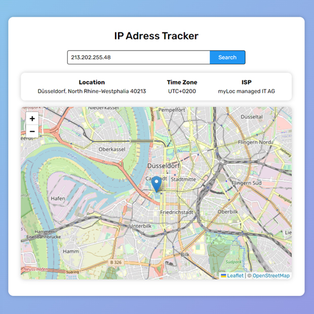

## IP Address Tracker
I am gonna showing to you how to code a ip address tracker with javascript. you can track users on map with their ip address. in this code we used leaflet and ipify api. Also this project is fully responsive❗️

# Screenshot
Here we have project screenshot :

